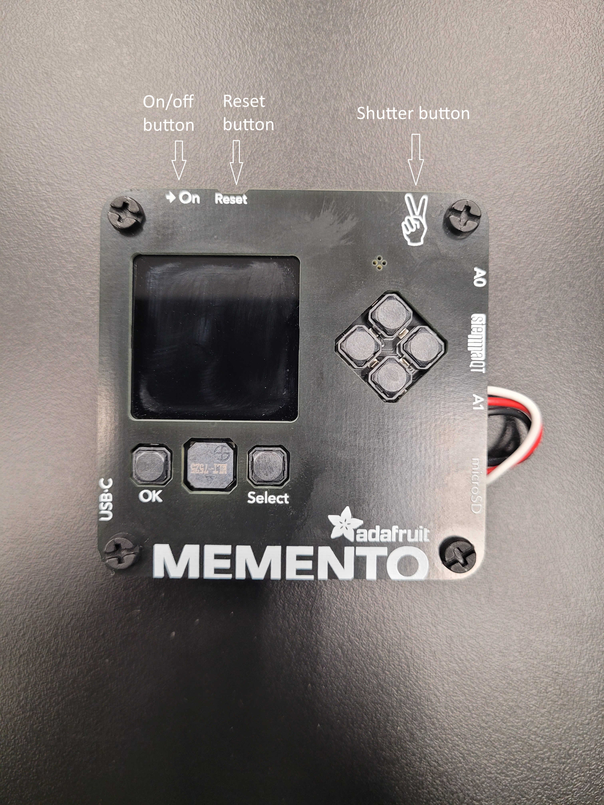
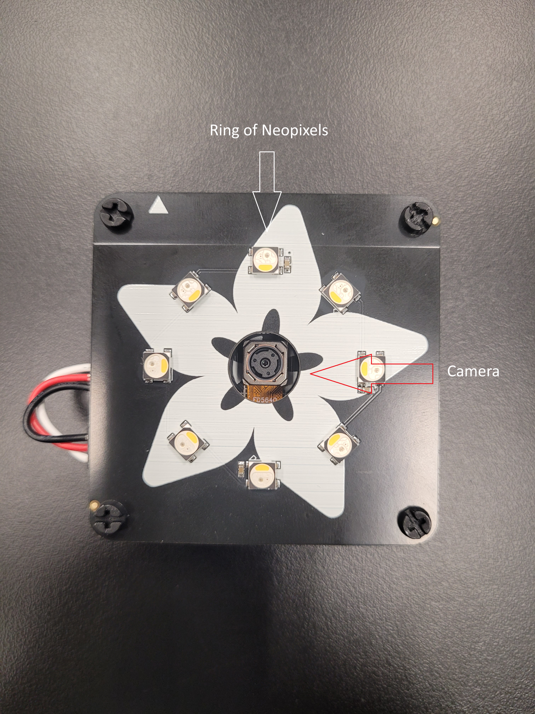
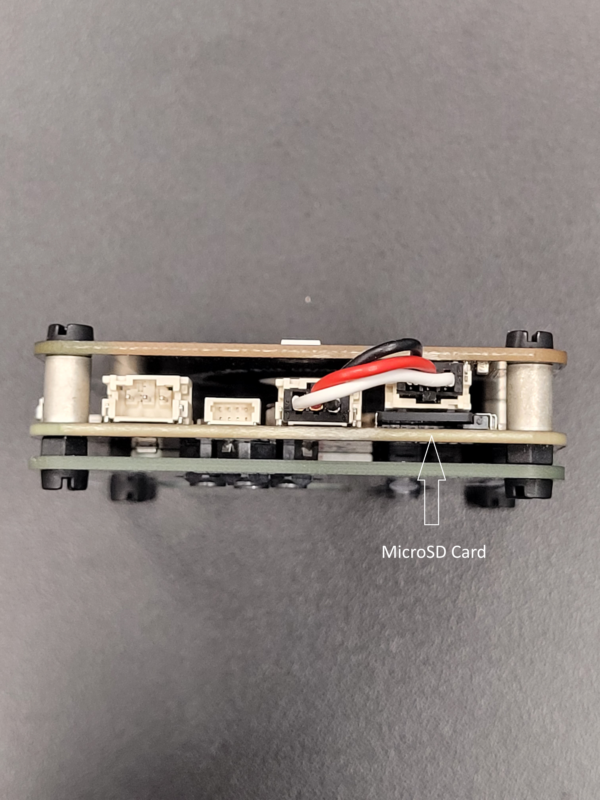
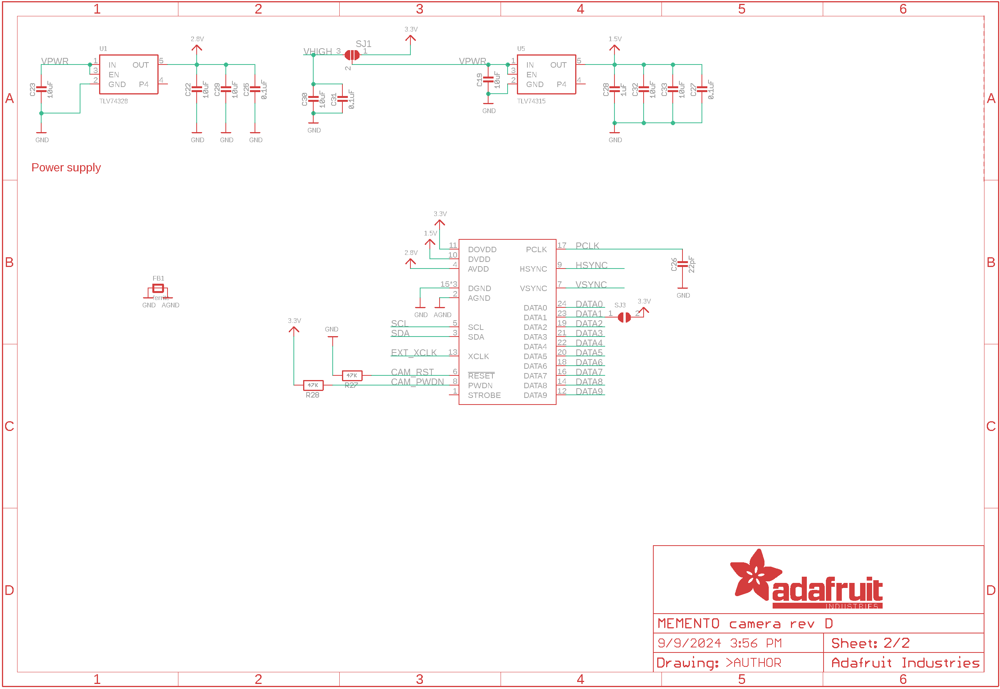
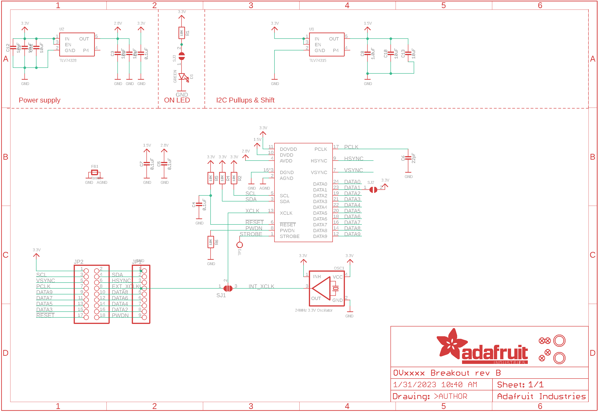

# OpenAI Camera
This project uses the Adafruit Memento camera to take a photo, and send that photo to OpenAI to get a variety of different text descriptions of the image, like a haiku. Additionally, it has the ability to change inbuilt camera settings, like autofocus and flash.
<!-- Update this text with a brief description (2-3 sentences) of your project. This description should draw the reader in and make them interested in what you've built. You can include what the biggest challenges, takeaways, and triumphs from completing the project were. As you complete your portfolio, remember your audience is less familiar than you are with all that your project entails! -->

<!-- You should comment out all portions of your portfolio that you have not completed yet, as well as any instructions: -->

| **Engineer** | **School** | **Area of Interest** | **Grade** |
|:--:|:--:|:--:|:--:|
| Shrey D | Lynbrook High School | Mechanical Engineering | Incoming Sophomore

<!-- **Replace the BlueStamp logo below with an image of yourself and your completed project. Follow the guide [here](https://tomcam.github.io/least-github-pages/adding-images-github-pages-site.html) if you need help.** -->


  
# Final Milestone

<iframe width="560" height="315" src="https://www.youtube.com/embed/OPHciDJiWSk?si=Szw3sofGqv7ztG4z" title="YouTube video player" frameborder="0" allow="accelerometer; autoplay; clipboard-write; encrypted-media; gyroscope; picture-in-picture; web-share" referrerpolicy="strict-origin-when-cross-origin" allowfullscreen></iframe>

## Summary

The third and final milestone for my OpenAI Camera was designing a protective 3D printed case for the camera. As it stands, the camera by itself is fairly unprotected and it is easy to mess with it in a variety of different ways, like taking out the SD card while the camera is on, which ruins the SD card and requires it to be reformatted, losing all data. Additionally, because of the camera's small size, it isn't that easy to hold. The case, while making the camera slightly bigger, makes it much easier to hold by adding more space for one's hand to rest. I faced a lot of challenges with designing the case, like making external buttons, working hinges, a latch to hold it closed, and a hole in the side for the USBC port.

## Challenges

When designing my case, I made the initial, and wrong, assumption that the Memento was a square prism, and I thought I would just have the make an appropriately sized square box to put it inside of. Unfortuantely, the Memento has a button, a switch, a USBC port, and a wire that stick out on the sides, preventing it from properly fitting into a square prism of the same measurements from any side. This design flaw has plagued many of my reprints of the case, but I eventually figured out a way to circumnavigate it. By splitting the case in half, I could add holes in the sides. For the USBC port and the button, I realized I wanted the user to be able to interact with them easily, so I made holes in the side of the case so they could be accessed, and eventually made an external attachment for the button that allowed it to be pressed easier. The wire that stuck out of the side of the case connected the LEDs to the board, so I covered it so the connection couldn't be messed with. Finally, the on-off switch on the top of the board got its own recessed hole so it could be interacted with on purpose, but not accidentally.

Another problem I faced was the mechanism for closing the case. Initially, I designed pins with a tolerance of 0 mm, so when I pushed the two halves together, they would remain stuck together due to friction. However, this was only a temporary solution to test if the case would fit properly. A permanent enclosure means that any problems with the components inside would require a lot of effort to take apart the case. To make the case able to be opened, I decided a hinge and a latch would be a good mechanism. A good latch would be hard to open, making the case strong, but not impossible, allowing interior components to be accessed. Hinges would keep the two halves of the case together. I experienced a lot of problems with the latch, as I had never designed a latch before. Luckily, my third latch design worked well enough for it the be the final one. I experienced some problems with parts of my hinge design snapping, but I'm fairly sure it's just the filament I was using, as when I swapped to another filament, the hinge worked just fine.

One of the more unexpected problems I faced was with the buttons of the camera. Because of the thickness of my case, roughly 3 mm, the small buttons on the board were too deep inside to be accessed properly. Because of this, I designed external attachments for the buttons that fit into cylindrical holes so the buttons would become taller, allowing them to be pressed easier. The final case requires 7 of these attachments, 1 for the shutter button, 4 for the directional buttons, and 2 for the OK and Select buttons. Luckily the buttons only needed minor adjustments for press depth. 

## Next Steps

If I could add anything more to my project, it would most likely be a speaker. Initially, after my second milestone, I wanted to add a speaker, but I realized my camera didn't supply enough voltage to the speaker for it to make a significant amount of noise. As such, the speaker could only be heard when held up to one's ear. The reason I wanted to add a speaker was for text to speech. The Memento has a buzzer that lets it play frequencies, but I wanted it to read the text from OpenAI out loud. It would've allowed me to add a massive feature to my camera, but it just didn't work. If I had more time, I would connect a speaker directly to the power source powering my Memento, allowing it to receive more voltage.

# Second Milestone

<iframe width="560" height="315" src="https://www.youtube.com/embed/m5oPV_kyGF0?si=Vs4LNTCf7iLXl55b" title="YouTube video player" frameborder="0" allow="accelerometer; autoplay; clipboard-write; encrypted-media; gyroscope; picture-in-picture; web-share" referrerpolicy="strict-origin-when-cross-origin" allowfullscreen></iframe>

## Summary

The second milestone for my OpenAI Camera was focused on quality of life, including editing the code I already had for the camera to make it more intuitive to interact with, and adding more features people would want in a camera, because it lacked many things. To do this, I took the functions from the OpenAI Camera that allowed it to send images to OpenAI, and the massive runtime while loop from the Fancy Camera that allowed the user to change the settings, and combined them together. It took a very long time to understand how both programs work, and even longer to combine them together. After the combination of both programs, I realized the camera still lacked a lot of features most regular cameras have, for example, flash. I added these features, but then realized the camera's controls were confusing. To combat this, I added an on-screen displays that shows what each button does.


<p>A diagram showcasing how I combined the OpenAI Camera code and the Fancy Camera code to create my own code, which had features from both programs.</p>
<a href="https://learn.adafruit.com/openai-image-descriptors-with-memento/circuitpython-code" target="_blank">OpenAI Camera</a>
<a href="https://learn.adafruit.com/memento-camera-quick-start-guide/fancy-camera" target="_blank">Fancy Camera</a>

## Challenges

I had a lot of trouble when I was adding my own new features to the camera's code, especially with flash. The way flash works on a regular camera is that a bright light turns on, the camera takes a photo, and then that bright light turns off. That all happens in an instant. When I coded flash onto my camera, the light worked perfectly, and the images taken with flash on were noticably brighter. However, for some reason, when taking an image with flash, the screen wouldn't update when the image was taken, so it looked like an image was taken without flash. I spent an entire week trying to figure out why it wasn't working, but gave up and decided to work on other features. However, when I eventually came back to it, I figured out there was a command that updated the camera's screen, so if I updated the camera's screen once the flash would turn on, the screen would show an image taken with flash.

I also had a little bit of trouble with making displays for the camera settings. These are the camera effects I currently display on the screen: prompt sent to OpenAI, camera filter, flash, LED level, LED color, and a countdown timer. If I displayed them all as text, they would either be super tiny and hard to read, or there wouldn't be enough space to fit all of them. To solve this problem, I created custom visual displays for LED level, LED color, and flash. I was unfamiliar with how to render polygons onto the screen, and so I looked up modules like vectorio and displayio. I figured out I could make my own polygons, but I would have to manually enter points for the vertices of the polygon. Eventually, I was able to make a lightning bolt that changes color with flash, and 8 circles that correspond to the eight LEDs to show both how bright they are and what color they are.

Finally, when I asked other people to use the camera, they didn't know what all the buttons did, and because of that, they couldn't use all of the features of the camera. To combat this, I added displays to the bottom of the screen that look like buttons and a text box. The text box displays a new message every six seconds, like "Take a photo," or "Change setting." To match that message, the buttons that do that action, like the shutter button, light up, so the user can see which buttons do what.

## Next Steps

The camera, despite having two plates covering most of its wiring and the PCB, is still quite exposed, It is very easy to unplug neccesary wiring and remove the SD card while the camera is turned on, which can cause a lot of problems. In my testing, removing the SD card while the camera is on messes with it in a way that the camera won't recognize it as an SD card. To fix this, the SD card needs to be reformatted, but unfortunately, reformatting the SD card erases all the data on it, meaning all of the photos. In order to prevent all of these issues, I will design a 3D printed case to protect the camera's insides.

# First Milestone

<!-- **Don't forget to replace the text below with the embedding for your milestone video. Go to Youtube, click Share -> Embed, and copy and paste the code to replace what's below.** -->

<iframe width="560" height="315" src="https://www.youtube.com/embed/L-g1tkvBFc0?si=UEiRiNsshfH5kpLt" title="YouTube video player" frameborder="0" allow="accelerometer; autoplay; clipboard-write; encrypted-media; gyroscope; picture-in-picture; web-share" referrerpolicy="strict-origin-when-cross-origin" allowfullscreen></iframe>

## Summary

The first milestone for my OpenAI Camera was its assembly and installing CircuitPython on it. When I received the parts for my project, I got the Memento board that had the camera, screen, and buttons on it, and two additional plates that could be screwed onto the board to better protect the PCB. The plate that screwed onto the screen side of the board just had holes for the screen and for the buttons, but the plate that screwed onto the camera side of the board had Neopixels that had to be plugged in to the main board. After assembly, the camera would only be able to run a very basic camera app, that lacked many quality of life features. In order to install and make a better camera application, I would have to install CircuitPython onto the Memento, so I could run Python code onto it.

## Challenges

The biggest challenge I faced for this milestone was installing CircuitPython on the Memento. Normally, this would be an easy task. The Memento typically has its own lithium ion battery, which provides power automatically. To install CircuitPython, the Memento just has to be connected to a Laptop via USB, and then CircuitPython can be installed. However, I wasn't allowed to use a lithium ion battery, so my Memento's one USB-C port was always used to power it, not to transfer data. For some reason, whenever I plugged my Memento into my laptop, it wouldn't turn on, and the laptop wouldn't recognize it as a USB device. After a lot of fiddling with the cable, I figured out when I plugged in a specific end of the cable into my Memento first, and then the other end into my laptop, the Memento would turn on and be connected. I don't know exactly why it works, but I was able to install CircuitPython with no other hiccups.

## Next Steps

As I stated earlier in the summary, the point of installing CircuitPython onto the board is so I can run Python code on it, to make a better camera application. My next milestone will involve installing the OpenAI Camera code onto the board, so I can run a camera application that will send images to OpenAI, and get back a text description of the image. In my initial previews of that code, I have garnered that its primary purpose is to take a photo, encode it into a format an AI can understand, and send that photo, along with a text prompt about that photo, to OpenAI. OpenAI will look at the photo and the prompt, and then generate a brief paragraph. OpenAI will then send that paragraph back to my Memento through the Wifi, and the Memento will display the paragraph on the screen as a popup.

## Images

<p>An image of my Memento from the screen side, showcasing its buttons.</p>

<p>An image of my Memento from the camera side, showcasing the camera and the Neopixels.</p>

<p>An image of my Memento from the side with the ports and the MicroSD card.</p>

# Schematics 

<p>A schematic of most of the modules on my Memento board.</p>
<a href="https://learn.adafruit.com/adafruit-memento-camera-board/downloads" target="_blank">Source</a>
<p></p>

<p>A second schematic containing more modules on my Memento board.</p>
<a href="https://learn.adafruit.com/adafruit-memento-camera-board/downloads" target="_blank">Source</a>
<p></p>

<p>A third schematic that is about the camera on my Memento board.<\p>
<a href="https://learn.adafruit.com/adafruit-ov5640-camera-breakout/downloads" target="_blank">Source</a>
<p></p>


# Code

```python
# SPDX-FileCopyrightText: 2024 Liz Clark for Adafruit Industries
#
# SPDX-License-Identifier: MIT

import os
import time
import ssl
import binascii
import wifi
import vectorio
import socketpool
import adafruit_requests
import displayio
from jpegio import JpegDecoder
from adafruit_display_text import label, wrap_text_to_lines
import terminalio
import adafruit_pycamera
import random
import asyncio
import board
import adafruit_lis3dh

"""

A lot of the code in this project is from open-source code for the Memento Camera, mainly two projects, the OpenAI Camera and the Fancy Camera. Both of these projects are amazing by themselves, but both of them lack very important functionality, so I combined them to make a better script.

"""

"""

This section is basically configuring settings before the camera turns on, so everything works properly.

"""

# scale for displaying returned text from OpenAI
text_scale = 1

# OpenAI key and prompts from settings.toml
openai_api_key = os.getenv("OPENAI_API_KEY")
alt_text_prompt = os.getenv("ALT_TEXT_PROMPT")
haiku_prompt = os.getenv("HAIKU_PROMPT")
cable_prompt = os.getenv("CABLE_PROMPT")
translate_prompt = os.getenv("TRANSLATE_PROMPT")
alien_prompt = os.getenv("ALIEN_PROMPT")
weird_prompt = os.getenv("WEIRD_PROMPT")

pokemon_prompt = os.getenv("POKEMON_PROMPT")
translate_prompt = os.getenv("TRANSLATE_PROMPT")
define_prompt=os.getenv("DEFINE_PROMPT")
celebrity_prompt=os.getenv("CELEBRITY_PROMPT")

# Putting all the prompts in a list
prompts = [alt_text_prompt,
           haiku_prompt,
           define_prompt,
           celebrity_prompt,
           pokemon_prompt,
           cable_prompt,
           translate_prompt,
           weird_prompt]
num_prompts = len(prompts)
prompt_index = 0
# Adding labels for the prompts that will show up on the screen
prompt_labels = ["Alt Text", "Haiku", "Define", "Celebrity", "Pokedex", "Cable ID","Translate", "Weird"]


# Setting flash to be off by default
flash = False

palette = displayio.Palette(4)
palette[0] = 0xFFFFFF
palette[1] = 0x000000
palette[2] = 0xFF0000
palette[3] = 0x444444

pycam = adafruit_pycamera.PyCamera()

startuprectangle = vectorio.Rectangle(width=240, height=240, x=0, y=0, pixel_shader=palette, color_index=1)

i2c = board.I2C()  # uses board.SCL and board.SDA
lis3dh = adafruit_lis3dh.LIS3DH_I2C(i2c, address=0x19)
lis3dh.range = adafruit_lis3dh.RANGE_8_G

# Startup tone for camera
rand = random.randint(0,9)
rand2 = random.randint(0,99)

"""
if rand2 == 0:
    if rand == 0:
        pycam.tone(208, 0.4)
        pycam.tone(349, 0.4)
        pycam.tone(311, 0.4)
        pycam.tone(262, 0.2)
        pycam.tone(208, 0.2)
        pycam.tone(233, 0.2)
        pycam.tone(262, 0.2)
        pycam.tone(233, 0.2)
        pycam.tone(208, 0.2)
        pycam.tone(175, 0.4)
        pycam.tone(156, 0.4)
    else:
        pycam.tone(831, 0.2)
        pycam.tone(659, 0.2)
        pycam.tone(831, 0.2)
        pycam.tone(932, 0.2)
        pycam.tone(1047, 0.2)
        pycam.tone(932, 0.2)
        pycam.tone(831, 0.2)
        pycam.tone(659, 0.2)
        pycam.tone(622, 0.4)
else:
    pycam.tone(330/2, 0.2)
"""

pycam.tone(330/2, 0.2)

pycam.mode = 0  # only mode 0 (JPEG) will work in this example

# Resolution of 320x240 is plenty for OpenAI
pycam.resolution = 1  # 0-12 preset resolutions:
#                      0: 240x240, 1: 320x240, 2: 640x480, 3: 800x600, 4: 1024x768,
#                      5: 1280x720, 6: 1280x1024, 7: 1600x1200, 8: 1920x1080, 9: 2048x1536,
#                      10: 2560x1440, 11: 2560x1600, 12: 2560x1920

settings = (
    "flash",
    "led_level",
    "led_color",
    "countdown",
    "effect",
    "prompt"
)

setting_displays = (
    "Selected:\nFlash",
    "Selected:\nLED Level",
    "Selected:\nLED Color",
    "Selected:\nCountdown",
    "Selected:\nEffect",
    "Selected:\nAI Prompt"
)

setting_labels = (
    "Flash",
    "LED Level",
    "LED Color",
    "Countdown",
    "Effect",
    "Prompt"
)

curr_setting = 0

countdown_times = (
    0,
    3,
    5,
    10
)

current_countdown = 0

pycam.led_level = 0  # 0-4 preset brightness levels
led_levels = (
    "No Light",
    "Level 1",
    "Level 2",
    "Level 3",
    "Level 4"
)
current_level = 0

# pycam.led_color = 0  # 0-7  preset colors: 0: white, 1: green, 2: yellow, 3: red,
#                                          4: pink, 5: blue, 6: teal, 7: rainbow
led_colors = (
    "White",
    "Green",
    "Yellow",
    "Red",
    "Magenta",
    "Blue",
    "Cyan",
    "Rainbow"
)
corr_colors= (
    0xFFFFFF,
    0x00FF00,
    0xFFFF00,
    0xFF0000,
    0xFF00FF,
    0x0000FF,
    0x00FFFF,
    0xFFFFFF
)
current_color = 0

pycam.effect = 0  # 0-7 preset FX: 0: normal, 1: invert, 2: b&w, 3: red,
#                                  4: green, 5: blue, 6: sepia, 7: solarize
effects = (
    "No Effect",
    "Invert",
    "B & W",
    "Red",
    "Green",
    "Blue",
    "Sepia",
    "Solarize"
)

effect_colors = (
    0xFFFFFF,
    0xFFFFFF,
    0x555555,
    0xFF6666,
    0x66FF66,
    0x6666FF,
    0x996600,
    0xFF6600
)

current_effect = 0

# add label for selected prompt
rect = vectorio.Rectangle(pixel_shader=palette, width=240, height=50, x=0, y=-10, color_index=1)
recttwo = vectorio.Rectangle(pixel_shader=palette, width = 240, height=50, x=0, y=0, color_index=1)

lightningrect = vectorio.Rectangle(pixel_shader=palette, width=20, height=25, x=4, y=4, color_index=0)

lightningx = 200

linearrect1 = vectorio.Rectangle(pixel_shader=palette, width=1, height=35, x=165, y=0, color_index=3)
linearrect2 = vectorio.Rectangle(pixel_shader=palette, width=1, height=35, x=135, y=-5, color_index=3)


# Hand made lightning symbol
pointlist=[(0,0), (-5, 13), (3, 15), (0, 24), (13, 11), (5, 9), (10, 0)]
lightning = vectorio.Polygon(pixel_shader=palette, points=pointlist, x=210-lightningx, y=5, color_index=1)

# Inner lightning symbol that is turned black or white
innerpointlist=[(1, 1), (-3, 12), (5, 14), (1, 22), (11, 12), (3, 10), (8, 1)]
innerlightning = vectorio.Polygon(pixel_shader=palette, points=innerpointlist, x=210-lightningx, y=5, color_index=0)

# Text that displays prompt on screen
prompt_txt = label.Label(
            terminalio.FONT, text=prompt_labels[prompt_index], color=0xFFFFFF, x=105, y=24, scale=1, padding_left=1
        )

effect_txt = label.Label(
            terminalio.FONT, text=effects[current_effect], color=0xFFFFFF, x=105, y=8, scale=1, background_color=None, padding_left=1
        )

countdown_txt = label.Label(
            terminalio.FONT, text=str(countdown_times[current_countdown])+"s", color=0xFFFFFF, x=63, y=15, scale=2, padding_left=1
        )

level_txt = label.Label(
            terminalio.FONT, text="0", color=0x444444, x=40, y=17, scale=1, padding_left=1
        )

setting_txt = label.Label(
            terminalio.FONT, text=setting_displays[curr_setting], color=0xFFFFFF, x=175, y=8, scale=1
        )

idle_sentences = [
    "Take a photo",
    "Select photo from SD",
    "Cycle through settings",
    "Change the setting"
]

current_idle_sentence = -1

select_sentences = [
    "Send photo to AI",
    "Cycle through photos"
]

current_select_sentence = -1

bottom_txt = label.Label(
            terminalio.FONT, text="", color = 0xFFFFFF, scale=1, line_spacing=1, x=0, y=10
        )

direcbuttonradius = 4
direcbuttonx = 190
direcbuttony = 11
direcbuttonspacing = 7

direcbutton1 = vectorio.Circle(pixel_shader=palette, radius=direcbuttonradius, x=direcbuttonx, y=direcbuttony-direcbuttonspacing, color_index=3)
direcbutton2 = vectorio.Circle(pixel_shader=palette, radius=direcbuttonradius, x=direcbuttonx+direcbuttonspacing, y=direcbuttony, color_index=3)
direcbutton3 = vectorio.Circle(pixel_shader=palette, radius=direcbuttonradius, x=direcbuttonx, y=direcbuttony+direcbuttonspacing, color_index=3)
direcbutton4 = vectorio.Circle(pixel_shader=palette, radius=direcbuttonradius, x=direcbuttonx-direcbuttonspacing, y=direcbuttony, color_index=3)

shutterx = 215

shutterbutton = vectorio.Rectangle(pixel_shader=palette, x=shutterx, y=0, width=10, height=6, color_index=3)
shuttersquare = vectorio.Rectangle(pixel_shader=palette, x=shutterx-5, y=8, width=20, height=14, color_index=3)
innershuttersquare = vectorio.Rectangle(pixel_shader=palette, x=shutterx-5, y=10, width=18, height=12, color_index=1)

circlebuttonx= 155
circlebuttonspacing=10
circlebuttonradius = 4

circlebutton1 = vectorio.Circle(pixel_shader=palette, x=circlebuttonx-circlebuttonspacing, y=11, radius=circlebuttonradius, color_index=3)
circlebutton2 = vectorio.Circle(pixel_shader=palette, x=circlebuttonx+circlebuttonspacing, y=11, radius=circlebuttonradius, color_index=3)
screenrect = vectorio.Rectangle(pixel_shader=palette, x=circlebuttonx-(circlebuttonspacing+circlebuttonradius), y=0, height=5, width=(2*circlebuttonradius + 2*circlebuttonspacing + 1), color_index=3)
innerscreenrect = vectorio.Rectangle(pixel_shader=palette, x=circlebuttonx-(circlebuttonspacing+circlebuttonradius)+2, y=0, height=3, width=(2*circlebuttonradius + 2*circlebuttonspacing - 3), color_index=1)

# pylint: disable=protected-access
pycam._botbar.append(rect)
pycam._botbar.append(bottom_txt)
pycam._botbar.append(direcbutton1)
pycam._botbar.append(direcbutton2)
pycam._botbar.append(direcbutton3)
pycam._botbar.append(direcbutton4)

pycam._botbar.append(shutterbutton)
pycam._botbar.append(shuttersquare)
pycam._botbar.append(innershuttersquare)

pycam._botbar.append(circlebutton1)
pycam._botbar.append(circlebutton2)
pycam._botbar.append(screenrect)
pycam._botbar.append(innerscreenrect)

pycam._botbar.append(linearrect2)

pycam._topbar.append(recttwo)

pycam._topbar.append(lightningrect)

pycam._topbar.append(prompt_txt)
pycam._topbar.append(effect_txt)

#pycam._topbar.append(led_txt)
#pycam._topbar.append(color_txt)

pycam._topbar.append(lightning)
pycam._topbar.append(innerlightning)
pycam._topbar.append(countdown_txt)
pycam._topbar.append(setting_txt)

pycam._topbar.append(linearrect1)

allcolors = displayio.Palette(31)
allcolors[0]  = 0xFFFFFF
allcolors[1]  = 0x00FF00
allcolors[2]  = 0xFFFF00
allcolors[3]  = 0xFF0000
allcolors[4]  = 0xFF00FF
allcolors[5]  = 0x0000FF
allcolors[6]  = 0x00FFFF

allcolors[7]  = 0x444444
allcolors[8]  = 0x004400
allcolors[9]  = 0x444400
allcolors[10] = 0x440000
allcolors[11] = 0x440044
allcolors[12] = 0x000044
allcolors[13] = 0x004444

allcolors[14] = 0x000000

allcolors[15] = 0xFF8000
allcolors[16] = 0xBFFF00
allcolors[17] = 0x00FF00
allcolors[18] = 0x00FFBF
allcolors[19] = 0x0080FF
allcolors[20] = 0x4000FF
allcolors[21] = 0xFF00FF
allcolors[22] = 0xFF0040

allcolors[23] = 0x442200
allcolors[24] = 0x334400
allcolors[25] = 0x004400
allcolors[26] = 0x004433
allcolors[27] = 0x002244
allcolors[28] = 0x110044
allcolors[29] = 0x440044
allcolors[30] = 0x440011

nobars = True

barsx = 30

# Colored bars that represent color and level of LED lighting
"""
bar1 = vectorio.Rectangle(pixel_shader=allcolors, width=12, height=24, x=5+barsx,  y=5, color_index=7)
bar2 = vectorio.Rectangle(pixel_shader=allcolors, width=12, height=24, x=22+barsx, y=5, color_index=7)
bar3 = vectorio.Rectangle(pixel_shader=allcolors, width=12, height=24, x=39+barsx, y=5, color_index=7)
bar4 = vectorio.Rectangle(pixel_shader=allcolors, width=12, height=24, x=56+barsx, y=5, color_index=7)
"""
bar1 = vectorio.Rectangle(pixel_shader=allcolors, width=15, height=5, x=5+barsx, y=24, color_index=7)
bar2 = vectorio.Rectangle(pixel_shader=allcolors, width=15, height=5, x=5+barsx, y=17, color_index=7)
bar3 = vectorio.Rectangle(pixel_shader=allcolors, width=15, height=5, x=5+barsx, y=10, color_index=7)
bar4 = vectorio.Rectangle(pixel_shader=allcolors, width=15, height=5, x=5+barsx, y=3, color_index=7)

arrowpoints=[(7,0), (8,0), (13,5), (2,5)]
arrow1 = vectorio.Polygon(pixel_shader=allcolors, points=arrowpoints, x=5+barsx, y=24, color_index=7)
arrow2 = vectorio.Polygon(pixel_shader=allcolors, points=arrowpoints, x=5+barsx, y=17, color_index=7)
arrow3 = vectorio.Polygon(pixel_shader=allcolors, points=arrowpoints, x=5+barsx, y=10, color_index=7)
arrow4 = vectorio.Polygon(pixel_shader=allcolors, points=arrowpoints, x=5+barsx, y=3, color_index=7)

led1 = vectorio.Circle(pixel_shader=allcolors, radius=1, x=2+barsx, y=16, color_index=7)
led2 = vectorio.Circle(pixel_shader=allcolors, radius=1, x=5+barsx, y=9, color_index=7)
led3 = vectorio.Circle(pixel_shader=allcolors, radius=1, x=12+barsx, y=6, color_index=7)
led4 = vectorio.Circle(pixel_shader=allcolors, radius=1, x=19+barsx, y=9, color_index=7)
led5 = vectorio.Circle(pixel_shader=allcolors, radius=1, x=22+barsx, y=16, color_index=7)
led6 = vectorio.Circle(pixel_shader=allcolors, radius=1, x=19+barsx, y=23, color_index=7)
led7 = vectorio.Circle(pixel_shader=allcolors, radius=1, x=12+barsx, y=26, color_index=7)
led8 = vectorio.Circle(pixel_shader=allcolors, radius=1, x=5+barsx, y=23, color_index=7)

if not nobars:
    pycam._topbar.append(bar1)
    pycam._topbar.append(bar2)
    pycam._topbar.append(bar3)
    pycam._topbar.append(bar4)

    pycam._topbar.append(arrow1)
    pycam._topbar.append(arrow2)
    pycam._topbar.append(arrow3)
    pycam._topbar.append(arrow4)
else:
    pycam._topbar.append(led1)
    pycam._topbar.append(led2)
    pycam._topbar.append(led3)
    pycam._topbar.append(led4)
    pycam._topbar.append(led5)
    pycam._topbar.append(led6)
    pycam._topbar.append(led7)
    pycam._topbar.append(led8)

    pycam._topbar.append(level_txt)

def updatebars(level_selected=False, color_selected=False):
    global current_level
    global current_color

    if not nobars:
        bars = [7, 7, 7, 7]

        if current_level > 0:
            bars[0] -= 7
        if current_level > 1:
            bars[1] -= 7
        if current_level > 2:
            bars[2] -= 7
        if current_level > 3:
            bars[3] -= 7
        
        
        if current_color != 7:
            bars[0] += current_color
            bars[1] += current_color
            bars[2] += current_color
            bars[3] += current_color
        else:
            bars[0] += 3
            bars[1] += 2
            bars[2] += 1
            bars[3] += 5
        
        bar1.color_index = bars[0]
        bar2.color_index = bars[1]
        bar3.color_index = bars[2]
        bar4.color_index = bars[3]

        if not level_selected:
            arrow1.color_index = bars[0]
            arrow2.color_index = bars[1]
            arrow3.color_index = bars[2]
            arrow4.color_index = bars[3]
        else:
            if current_color != 7:
                arrow1.color_index = current_color
                arrow2.color_index = current_color
                arrow3.color_index = current_color
                arrow4.color_index = current_color
            else:
                arrow1.color_index = 3
                arrow2.color_index = 2
                arrow3.color_index = 1
                arrow4.color_index = 5
    else:
        if current_color != 7:
            if current_level > 0:
                led1.color_index = current_color
                led2.color_index = current_color
                led3.color_index = current_color
                led4.color_index = current_color
                led5.color_index = current_color
                led6.color_index = current_color
                led7.color_index = current_color
                led8.color_index = current_color

                level_txt.color = allcolors[current_color]
                level_txt.text = str(current_level)
            else:
                led1.color_index = current_color + 7
                led2.color_index = current_color + 7
                led3.color_index = current_color + 7
                led4.color_index = current_color + 7
                led5.color_index = current_color + 7
                led6.color_index = current_color + 7
                led7.color_index = current_color + 7
                led8.color_index = current_color + 7

                level_txt.color = allcolors[current_color + 7]
                level_txt.text = str(current_level)
        else:
            if current_level > 0:
                led1.color_index = 15
                led2.color_index = 16
                led3.color_index = 17
                led4.color_index = 18
                led5.color_index = 19
                led6.color_index = 20
                led7.color_index = 21
                led8.color_index = 22

                level_txt.color = allcolors[0]
                level_txt.text = str(current_level)
            else:
                led1.color_index = 15 + 8
                led2.color_index = 16 + 8
                led3.color_index = 17 + 8
                led4.color_index = 18 + 8
                led5.color_index = 19 + 8
                led6.color_index = 20 + 8
                led7.color_index = 21 + 8
                led8.color_index = 22 + 8

                level_txt.color = allcolors[7]
                level_txt.text = str(current_level)
        
        if not color_selected:
            led1.radius = 1
            led2.radius = 1
            led3.radius = 1
            led4.radius = 1
            led5.radius = 1
            led6.radius = 1
            led7.radius = 1
            led8.radius = 1
        else:
            led1.radius = 3
            led2.radius = 3
            led3.radius = 3
            led4.radius = 3
            led5.radius = 3
            led6.radius = 3
            led7.radius = 3
            led8.radius = 3
        
        if not level_selected:
            level_txt.background_color = None
        else:
            if current_color != 7:
                level_txt.background_color = allcolors[current_color]
            else:
                level_txt.background_color = 0xFFFFFF
            level_txt.color = 0x000000

# pylint: enable=protected-access
pycam.display.refresh()

view = False
new_prompt = False
file_index = -1
```

```python
"""

This next section is the code for sending the image to OpenAI.
Most of it comes from the OpenAI Camera source code from Adafruit.
I have barely edited this, so it should work without much error.

"""

# sort image files by numeric order
all_images = [
    f"/sd/{filename}"
    for filename in os.listdir("/sd")
    if filename.lower().endswith(".jpg")
    ]
all_images.sort(key=lambda f: int(''.join(filter(str.isdigit, f))))

decoder = JpegDecoder()
# used for showing images from sd card
bitmap = displayio.Bitmap(240, 176, 65535)

# encode jpeg to base64 for OpenAI
def encode_image(image_path):
    with open(image_path, 'rb') as image_file:
        image_data = image_file.read()
        base64_encoded_data = binascii.b2a_base64(image_data).decode('utf-8').rstrip()
        return base64_encoded_data

# view returned text on MEMENTO screen
def view_text(the_text):
    rectangle = vectorio.Rectangle(
        pixel_shader=palette, width=190, height=120, x=25, y=60, color_index=1
    )
    pycam.splash.append(rectangle)
    the_text = "\n".join(wrap_text_to_lines(the_text, 30))
    if prompt_index == 1:
        the_text = the_text.replace("*", "\n")
    text_area = label.Label(terminalio.FONT, text=the_text,
                            color=0xFFFFFF, x=30, y=70, scale=text_scale)
    pycam.splash.append(text_area)

    pycam.display.refresh()

# send image to OpenAI, print the returned text and save it as a text file
def send_img(img, prompt):
    base64_image = encode_image(img)
    headers = {
      "Content-Type": "application/json",
      "Authorization": f"Bearer {openai_api_key}"
    }
    payload = {
      "model": "gpt-4-turbo",
      "messages": [
        {
          "role": "user",
          "content": [
            {
              "type": "text",
              "text": f"{prompt} Limit your response to 210 characters."
            },
            {
              "type": "image_url",
              "image_url": {
                "url": f"data:image/jpeg;base64,{base64_image}"
              }
            }
          ]
        }
      ],
      "max_tokens": 300
    }
    response = requests.post("https://api.openai.com/v1/chat/completions",
                             headers=headers, json=payload)
    json_openai = response.json()
    print(json_openai['choices'][0]['message']['content'])
    alt_text_file = img.replace('jpg', 'txt')
    alt_text_file = alt_text_file[:11] + f"_{prompt_labels[prompt_index]}" + alt_text_file[11:]
    if prompt_index == 5:
        alt_text_file = alt_text_file.replace("?", "")
    with open(alt_text_file, "a") as fp:
        fp.write(json_openai['choices'][0]['message']['content'])
        fp.flush()
        time.sleep(1)
        fp.close()
    view_text(json_openai['choices'][0]['message']['content'])
# view images on sd card to re-send to OpenAI
def load_image(bit, file):
    bit.fill(0b00000_000000_00000)  # fill with a middle grey
    decoder.open(file)
    decoder.decode(bit, scale=0, x=0, y=0)
    pycam.blit(bit, y_offset=32)
    pycam.display.refresh()

print()
print("Connecting to WiFi")
wifi.radio.connect(
    os.getenv('CIRCUITPY_WIFI_SSID'),
    os.getenv('CIRCUITPY_WIFI_PASSWORD')
)
print("Connected to WiFi")
pool = socketpool.SocketPool(wifi.radio)
requests = adafruit_requests.Session(pool, ssl.create_default_context())

"""

The next section of code is what the camera does after everything is set up properly

"""

wakemessages = [
    "Hello!",
    "Hi!",
    "Hey!",
    "What's up?",
    "Salutations!",
    "Greetings!",
]

snapmessages = [
    "Nice photo!",
    "Great photo!",
    "10/10!",
    "Five stars!",
    "Wow!",
    "Amazing!"
]

thinkmessages = [
    "Thinking...",
    "Ruminating...",
    "Analyzing...",
    "Ideating...",
    "Waiting...",
    "Uh..."
]

pycam.display_message(random.choice(wakemessages), color=0xFFFFFF)
#pycam.tone(554, 0.2)
#pycam.tone(440, 0.4)
time.sleep(1)

lis3dh.set_tap(1, 20)
now = time.time()-6
new_prompt_check = False
view_check = False

while True:

    if new_prompt and not new_prompt_check:
        new_prompt_check = True
        now=time.time()-6
    elif not new_prompt and new_prompt_check:
        new_prompt_check = False
        now=time.time()-6
    
    if view and not view_check:
        view_check = True
        now=time.time()-6
    elif not view and view_check:
        view_check = False
        now=time.time()-6
    

    if time.time() >= now+6:
        now=time.time()

        if new_prompt:
            current_select_sentence = (current_select_sentence + 1) % len(select_sentences)
            bottom_txt.text = select_sentences[current_select_sentence]
        elif view:
            bottom_txt.text = "Continue"
        else:
            current_idle_sentence = (current_idle_sentence + 1) % len(idle_sentences)
            bottom_txt.text = idle_sentences[current_idle_sentence]
        
        shutterbutton.color_index = 3
        circlebutton1.color_index = 3
        circlebutton2.color_index = 3
        direcbutton2.color_index = 3
        direcbutton4.color_index = 3
        direcbutton1.color_index = 3
        direcbutton3.color_index = 3

    if time.time() >= now+5:
        
        if new_prompt:
            if current_select_sentence == 0:
                circlebutton1.color_index = 3
            elif current_select_sentence == 1:
                direcbutton2.color_index = 0
                direcbutton4.color_index = 3
        elif view:
            circlebutton1.color_index = 3
        else:
            if current_idle_sentence == 0:
                shutterbutton.color_index = 3
            elif current_idle_sentence == 1:
                circlebutton2.color_index = 3
            elif current_idle_sentence == 2:
                direcbutton2.color_index = 0
                direcbutton4.color_index = 3
            elif current_idle_sentence == 3:
                direcbutton1.color_index = 3
                direcbutton3.color_index = 0
        pycam.display.refresh()
    
    elif time.time() >= now+4:

        if new_prompt:
            if current_select_sentence == 0:
                circlebutton1.color_index = 0
            elif current_select_sentence == 1:
                direcbutton2.color_index = 3
                direcbutton4.color_index = 0
        elif view:
            circlebutton1.color_index = 0
        else:
            if current_idle_sentence == 0:
                shutterbutton.color_index = 0
            elif current_idle_sentence == 1:
                circlebutton2.color_index = 0
            elif current_idle_sentence == 2:
                direcbutton2.color_index = 3
                direcbutton4.color_index = 0
            elif current_idle_sentence == 3:
                direcbutton1.color_index = 0
                direcbutton3.color_index = 3
        pycam.display.refresh()

    elif time.time() >= now+3:
        
        if new_prompt:
            if current_select_sentence == 0:
                circlebutton1.color_index = 3
            elif current_select_sentence == 1:
                direcbutton2.color_index = 0
                direcbutton4.color_index = 3
        elif view:
            circlebutton1.color_index = 3
        else:
            if current_idle_sentence == 0:
                shutterbutton.color_index = 3
            elif current_idle_sentence == 1:
                circlebutton2.color_index = 3
            elif current_idle_sentence == 2:
                direcbutton2.color_index = 0
                direcbutton4.color_index = 3
            elif current_idle_sentence == 3:
                direcbutton1.color_index = 3
                direcbutton3.color_index = 0
        pycam.display.refresh()
    
    elif time.time() >= now+2:
        
        if new_prompt:
            if current_select_sentence == 0:
                circlebutton1.color_index = 0
            elif current_select_sentence == 1:
                direcbutton2.color_index = 3
                direcbutton4.color_index = 0
        elif view:
            circlebutton1.color_index = 0
        else:
            if current_idle_sentence == 0:
                shutterbutton.color_index = 0
            elif current_idle_sentence == 1:
                circlebutton2.color_index = 0
            elif current_idle_sentence == 2:
                direcbutton2.color_index = 3
                direcbutton4.color_index = 0
            elif current_idle_sentence == 3:
                direcbutton1.color_index = 0
                direcbutton3.color_index = 3
        pycam.display.refresh()

    elif time.time() >= now+1:
        
        if new_prompt:
            if current_select_sentence == 0:
                circlebutton1.color_index = 3
            elif current_select_sentence == 1:
                direcbutton2.color_index = 0
                direcbutton4.color_index = 3
        elif view:
            circlebutton1.color_index = 3
        else:
            if current_idle_sentence == 0:
                shutterbutton.color_index = 3
            elif current_idle_sentence == 1:
                circlebutton2.color_index = 3
            elif current_idle_sentence == 2:
                direcbutton2.color_index = 0
                direcbutton4.color_index = 3
            elif current_idle_sentence == 3:
                direcbutton1.color_index = 3
                direcbutton3.color_index = 0
        pycam.display.refresh()
    
    elif time.time() >= now:
        
        if new_prompt:
            if current_select_sentence == 0:
                circlebutton1.color_index = 0
            elif current_select_sentence == 1:
                direcbutton2.color_index = 3
                direcbutton4.color_index = 0
        elif view:
            circlebutton1.color_index = 0
        else:
            if current_idle_sentence == 0:
                shutterbutton.color_index = 0
            elif current_idle_sentence == 1:
                circlebutton2.color_index = 0
            elif current_idle_sentence == 2:
                direcbutton2.color_index = 3
                direcbutton4.color_index = 0
            elif current_idle_sentence == 3:
                direcbutton1.color_index = 0
                direcbutton3.color_index = 3
        pycam.display.refresh()

    if new_prompt:
        pycam.display_message("SEND?")
    if not view:
        if not new_prompt:
            pycam.blit(pycam.continuous_capture())

    pycam.keys_debounce()

    if pycam.shutter.long_press and not view:
        #pycam.tone(330/2, 0.4)
        shutterbutton.height=4
        shutterbutton.y=2
        pycam.display.refresh()
        pycam.autofocus()
        shutterbutton.height=6
        shutterbutton.y=0
        pycam.display.refresh()
    if pycam.shutter.short_count and not view:

        now = time.time()

        times = [time.time()+1, time.time()+2, time.time()+3]

        if current_countdown != 0:

            countdowncolor=0xFFFFFF

            for i in range(0, countdown_times[current_countdown]):
                if i == countdown_times[current_countdown] - 1:
                    pycam.tone(330/2, 0.4)
                else:
                    pycam.tone(330/2, 0.1)
                while time.time() != now+1+i:
                    if countdown_times[current_countdown]-i < 4:
                        countdowncolor = 0xFF0000
                    pycam.display_message(" " + str(countdown_times[current_countdown]-i) + " ", color=countdowncolor, scale=4)
                    pycam.blit(pycam.continuous_capture())
                

        """
        pycam.tone(330/2, 0.2)
        pycam.tone(396/2, 0.2)
        pycam.tone(495/2, 0.2)
        pycam.tone(587/2, 0.2)
        """
        if flash:
                # turning on LEDs when the camera tries to take a photo
                #setattr(pycam, "led_level", 0)
                setattr(pycam, "led_level", current_level)
                #pycam.display_message("Flash!", color=0xFFFFFF)

        try:
            shutterbutton.color_index = 3
            circlebutton1.color_index = 3
            circlebutton2.color_index = 3
            direcbutton2.color_index = 3
            direcbutton4.color_index = 3
            direcbutton1.color_index = 3
            direcbutton3.color_index = 3
            bottom_txt.text=""

            shutterbutton.height=4
            shutterbutton.y=2
            pycam.display.refresh() 

            pycam.display_message(random.choice(snapmessages), color=0xFFFFFF)
            pycam.capture_jpeg()

            shutterbutton.height=6
            shutterbutton.y=0
            pycam.display.refresh()
            
            pycam.live_preview_mode()
        except TypeError as exception:
            pycam.display_message("Failed", color=0xFF0000)
            time.sleep(0.5)
            pycam.live_preview_mode()
        except RuntimeError as exception:
            pycam.display_message("Error\nNo SD Card", color=0xFF0000)
            time.sleep(0.5)

        all_images = [
        f"/sd/{filename}"
        for filename in os.listdir("/sd")
        if filename.lower().endswith(".jpg")
        ]
        all_images.sort(key=lambda f: int(''.join(filter(str.isdigit, f))))

        the_image = all_images[-1]

        decoder.open(the_image)
        decoder.decode(bitmap)
        pycam.blit(bitmap)

        pycam.display_message(random.choice(thinkmessages), color=0xFFFFFF)
        send_img(the_image, prompts[prompt_index])
        """
        pycam.tone(587/2, 0.2)
        pycam.tone(495/2, 0.2)
        pycam.tone(396/2, 0.2)
        pycam.tone(330/2, 0.2)
        """
        view = True
        if flash:
            setattr(pycam, "led_level", 0)

    if pycam.up.fell:
        direcbutton1.radius = 3

        key = settings[curr_setting]
        if key:
            if key == "prompt":
                prompt_index = (prompt_index + 1) % num_prompts
                prompt_txt.text = prompt_labels[prompt_index]
                pycam.display.refresh()
            elif key == "flash":
                flash = not flash
                if not flash:
                    setattr(pycam, "led_level", current_level)
                    innerlightning.color_index = 0
                    pycam.display.refresh()
                    pycam.display_message("Flash Off", color=0xFFFFFF)
                    time.sleep(0.25)
                else:
                    setattr(pycam, "led_level", 0)
                    if current_level == 0:
                        current_level = 1
                        updatebars(False, False)
                        pycam.display.refresh()
                    innerlightning.color_index = 1
                    pycam.display.refresh()
                    pycam.display_message("Flash On", color=0xFFFFFF)
                    time.sleep(0.25)
            elif key == "countdown":
                current_countdown = (current_countdown + 1) % len(countdown_times)
                countdown_txt.text = str(countdown_times[current_countdown])+"s"
                pycam.display.refresh()
            else:
                print("getting", key, getattr(pycam, key))
                setattr(pycam, key, getattr(pycam, key) + 1)
                if key == "led_color":
                    current_color = (current_color + 1) % len(led_colors)
                    updatebars(False, True)
                    pycam.display.refresh()
                    pycam.display_message(led_colors[current_color], color=corr_colors[current_color])
                    time.sleep(0.25)
                elif key == "led_level":
                    current_level = (current_level + 1) % len(led_levels)
                    
                    if flash:
                        if current_level == 0:
                            current_level = 1

                    updatebars(True, False)
                    pycam.display.refresh()
                    pycam.display_message(led_levels[current_level], color=0xFFFFFF)
                    time.sleep(0.25)
                elif key == "effect":
                    current_effect = (current_effect + 1) % len(effects)
                    effect_txt.text = effects[current_effect]
                    pycam.display.refresh()
                    pycam.display_message(effects[current_effect], color=effect_colors[current_effect])

    if pycam.down.fell:
        direcbutton3.radius = 3

        key = settings[curr_setting]
        if key:
            if key == "prompt":
                prompt_index = (prompt_index - 1) % num_prompts
                prompt_txt.text = prompt_labels[prompt_index]
                pycam.display.refresh()
            elif key == "flash":
                flash = not flash
                if not flash:
                    setattr(pycam, "led_level", current_level)
                    innerlightning.color_index = 0
                    pycam.display.refresh()
                    pycam.display_message("Flash Off", color=0xFFFFFF)
                    time.sleep(0.25)
                else:
                    setattr(pycam, "led_level", 0)
                    if current_level == 0:
                        current_level = 1
                        updatebars(False, False)
                        pycam.display.refresh()
                    innerlightning.color_index = 1
                    pycam.display.refresh()
                    pycam.display_message("Flash On", color=0xFFFFFF)
                    time.sleep(0.25)
            elif key == "countdown":
                current_countdown = (current_countdown - 1) % len(countdown_times)
                countdown_txt.text = str(countdown_times[current_countdown])+"s"
                pycam.display.refresh()
            else:
                setattr(pycam, key, getattr(pycam, key) - 1)
                if key == "led_color":
                    current_color = (current_color - 1) % len(led_colors)
                    updatebars(False, True)
                    pycam.display.refresh()
                    pycam.display_message(led_colors[current_color], color=corr_colors[current_color])
                    time.sleep(0.25)
                elif key == "led_level":
                    current_level = (current_level - 1) % len(led_levels)

                    if flash:
                        if current_level == 0:
                            current_level = 4

                    updatebars(True, False)
                    pycam.display.refresh()
                    pycam.display_message(led_levels[current_level], color=0xFFFFFF)
                    time.sleep(0.25)
                elif key == "effect":
                    current_effect = (current_effect - 1) % len(effects)
                    effect_txt.text = effects[current_effect]
                    pycam.display.refresh()
                    pycam.display_message(effects[current_effect], color=effect_colors[current_effect])

    if pycam.right.fell:
        direcbutton2.radius = 3

        if new_prompt:
            file_index = (file_index - -1) % -len(all_images)
            filename = all_images[file_index]
            load_image(bitmap, filename)
        else:
            curr_setting = (curr_setting + 1) % len(settings)

            prompt_txt.color = 0xFFFFFF
            prompt_txt.background_color = None

            effect_txt.color = effect_txt.color = effect_colors[current_effect]
            effect_txt.background_color = None

            countdown_txt.color = 0xFFFFFF
            countdown_txt.background_color = None

            lightningrect.color_index = 1
            lightning.color_index = 0

            updatebars(False, False)

            if not flash:
                innerlightning.color_index = 1
            else:
                innerlightning.color_index = 0

            if curr_setting == 4:
                #effect
                effect_txt.color = 0x000000
                effect_txt.background_color = 0xFFFFFF
            elif curr_setting == 0:
                #flash
                lightningrect.color_index = 0
                lightning.color_index = 1
                if not flash:
                    innerlightning.color_index = 0
                else:
                    innerlightning.color_index = 1
            elif curr_setting == 1:
                #level
                updatebars(True, False)
            elif curr_setting == 2:
                #color
                updatebars(False, True)
            elif curr_setting == 3:
                #countdown
                countdown_txt.color = 0x000000
                countdown_txt.background_color = 0xFFFFFF
            elif curr_setting == 5:
                #prompt
                prompt_txt.color = 0x000000
                prompt_txt.background_color = 0xFFFFFF
                
            pycam.display.refresh()

            setting_txt.text = setting_displays[curr_setting]
            pycam.display.refresh()

            if pycam.mode_text != "LAPS" and settings[curr_setting] == "timelapse_rate":
                curr_setting = (curr_setting + 1) % len(settings)
            print(settings[curr_setting])
            pycam.select_setting(settings[curr_setting])
            #pycam.display_message(setting_displays[curr_setting], color=0xFFFFFF, scale=2)
            if settings[curr_setting] == "led_level":
                setattr(pycam, "led_level", current_level)
            else:
                if flash:
                    setattr(pycam, "led_level", 0)
            time.sleep(0.25)

    if pycam.left.fell:
        direcbutton4.radius = 3

        if new_prompt:
            file_index = (file_index + -1) % -len(all_images)
            filename = all_images[file_index]
            load_image(bitmap, filename)
        else:
            curr_setting = (curr_setting - 1) % len(settings)

            prompt_txt.color = 0xFFFFFF
            prompt_txt.background_color = None

            effect_txt.color = effect_txt.color = effect_colors[current_effect]
            effect_txt.background_color = None

            countdown_txt.color = 0xFFFFFF
            countdown_txt.background_color = None

            lightningrect.color_index = 1
            lightning.color_index = 0

            updatebars(False, False)

            if curr_setting == 4:
                #effect
                effect_txt.color = 0x000000
                effect_txt.background_color = 0xFFFFFF
            elif curr_setting == 0:
                #flash
                lightningrect.color_index = 0
                lightning.color_index = 1
                if not flash:
                    innerlightning.color_index = 0
                else:
                    innerlightning.color_index = 1
            elif curr_setting == 1:
                #level
                updatebars(True, False)
            elif curr_setting == 2:
                #color
                updatebars(False, True)
            elif curr_setting == 3:
                #countdown
                countdown_txt.color = 0x000000
                countdown_txt.background_color = 0xFFFFFF
            elif curr_setting == 5:
                #prompt
                prompt_txt.color = 0x000000
                prompt_txt.background_color = 0xFFFFFF
                
            pycam.display.refresh()

            setting_txt.text = setting_displays[curr_setting]
            pycam.display.refresh()

            if pycam.mode_text != "LAPS" and settings[curr_setting] == "timelapse_rate":
                curr_setting = (curr_setting - 1) % len(settings)
            print(settings[curr_setting])
            pycam.select_setting(settings[curr_setting])
            #pycam.display_message(setting_displays[curr_setting], color=0xFFFFFF, scale=2)
            if settings[curr_setting] == "led_level":
                setattr(pycam, "led_level", current_level)
            else:
                if flash:
                    setattr(pycam, "led_level", 0)
            time.sleep(0.25)

    if pycam.select.fell:
        circlebutton2.radius = 3

        if not new_prompt and not view:
            file_index = -1
            new_prompt = True
            filename = all_images[file_index]
            load_image(bitmap, filename)
        elif not view:
            new_prompt = False
            pycam.display.refresh()

    if pycam.ok.fell:
        circlebutton1.radius = 3

        if view:
            pycam.splash.pop()
            pycam.splash.pop()
            pycam.display.refresh()
            view = False
        if new_prompt:
            pycam.display_message(random.choice(thinkmessages), color=0xFFFFFF)
            send_img(filename, prompts[prompt_index])
            new_prompt = False
            view = True
    
    if pycam.up.rose:
        direcbutton1.radius = direcbuttonradius

    if pycam.down.rose:
        direcbutton3.radius = direcbuttonradius

    if pycam.right.rose:
        direcbutton2.radius = direcbuttonradius

    if pycam.left.rose:
        direcbutton4.radius = direcbuttonradius

    if pycam.ok.rose:
        circlebutton1.radius = circlebuttonradius

    if pycam.select.rose:
        circlebutton2.radius = circlebuttonradius
```

# Bill of Materials

| **Part** | **Note** | **Price** | **Link** |
|:--:|:--:|:--:|:--:|
| Adafruit Memento Camera Board | Taking photos and housing other components | $34.95 | <a href="https://www.adafruit.com/product/5420"> Link </a> |
| 256MB Micro SD Card | Storing photos and text | $4.50 | <a href="https://www.adafruit.com/product/5251"> Link </a> |

# Starter Project: Retro Arcade Console
<iframe width="560" height="315" src="https://www.youtube.com/embed/QSVcFWAX7O8?si=au_ZTLx9YDTecXB0" title="YouTube video player" frameborder="0" allow="accelerometer; autoplay; clipboard-write; encrypted-media; gyroscope; picture-in-picture; web-share" referrerpolicy="strict-origin-when-cross-origin" allowfullscreen></iframe>


My starter project was a mini retro arcade console. This project marked the first time I had to solder anything. Naturally I had some problems in the beginning, but I've learned how to make and recognize good soldering work, after soldering dozens of joints. One of the challenges with this project was when I soldered something upside-down, a semi-permanent mistake that I had no idea how to fix. But, with the help of my instructors, I was able to fix the problem and create a finished product I'm happy with.

# Schematics


<a href="https://www.hackster.io/lewisdiy/build-your-own-game-console-kit-play-the-classic-games-5ca95f#schematics" target="_blank">Source</a>

# Bill of Materials

| **Part** | **Note** | **Price** | **Link** |
|:--:|:--:|:--:|:--:|
| DIY Soldering Project Game Kit Retro Classic Electronic Soldering Kit with 5 Retro Classic Games and Acrylic Case | Code for game, housing, and all parts neccesary | $24.99 | <a href="https://etoput.com/products/diy-soldering-project-game-kit-retro-classic-electronic-soldering-kit-with-5-retro-classic-games-and-acrylic-case"> Link </a> |

<!-- # Other Resources/Examples
One of the best parts about Github is that you can view how other people set up their own work. Here are some past BSE portfolios that are awesome examples. You can view how they set up their portfolio, and you can view their index.md files to understand how they implemented different portfolio components.
- [Example 1](https://trashytuber.github.io/YimingJiaBlueStamp/)
- [Example 2](https://sviatil0.github.io/Sviatoslav_BSE/)
- [Example 3](https://arneshkumar.github.io/arneshbluestamp/)

To watch the BSE tutorial on how to create a portfolio, click here. -->
