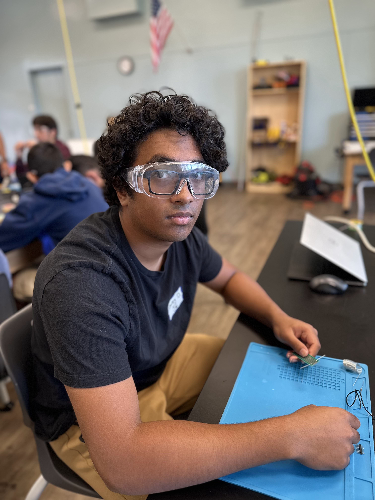
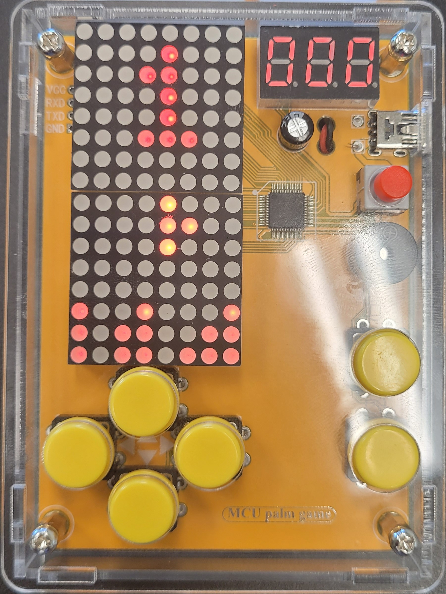

# Intensive Project: OpenAI Camera
My OpenAI Camera uses the Adafruit Memento camera and connects to OpenAI to create text descriptions for images it takes in a variety of different ways. I aim to add a speaker, a way to send photos to other devices, and filters for photos.
<!-- Update this text with a brief description (2-3 sentences) of your project. This description should draw the reader in and make them interested in what you've built. You can include what the biggest challenges, takeaways, and triumphs from completing the project were. As you complete your portfolio, remember your audience is less familiar than you are with all that your project entails! -->

<!-- You should comment out all portions of your portfolio that you have not completed yet, as well as any instructions: -->


| **Engineer** | **School** | **Area of Interest** | **Grade** |
|:--:|:--:|:--:|:--:|
| Shrey D | Lynbrook High School | Mechanical Engineering | Incoming Sophomore

<!-- **Replace the BlueStamp logo below with an image of yourself and your completed project. Follow the guide [here](https://tomcam.github.io/least-github-pages/adding-images-github-pages-site.html) if you need help.** -->


  
<!-- # Final Milestone

**Don't forget to replace the text below with the embedding for your milestone video. Go to Youtube, click Share -> Embed, and copy and paste the code to replace what's below.**

<iframe width="560" height="315" src="https://www.youtube.com/embed/F7M7imOVGug" title="YouTube video player" frameborder="0" allow="accelerometer; autoplay; clipboard-write; encrypted-media; gyroscope; picture-in-picture; web-share" allowfullscreen></iframe>

For your final milestone, explain the outcome of your project. Key details to include are:
- What you've accomplished since your previous milestone
- What your biggest challenges and triumphs were at BSE
- A summary of key topics you learned about
- What you hope to learn in the future after everything you've learned at BSE -->


<!-- # Second Milestone

**Don't forget to replace the text below with the embedding for your milestone video. Go to Youtube, click Share -> Embed, and copy and paste the code to replace what's below.**

<iframe width="560" height="315" src="https://www.youtube.com/embed/y3VAmNlER5Y" title="YouTube video player" frameborder="0" allow="accelerometer; autoplay; clipboard-write; encrypted-media; gyroscope; picture-in-picture; web-share" allowfullscreen></iframe>

For your second milestone, explain what you've worked on since your previous milestone. You can highlight:
- Technical details of what you've accomplished and how they contribute to the final goal
- What has been surprising about the project so far
- Previous challenges you faced that you overcame
- What needs to be completed before your final milestone -->

# First Milestone

<!-- **Don't forget to replace the text below with the embedding for your milestone video. Go to Youtube, click Share -> Embed, and copy and paste the code to replace what's below.** -->

<iframe width="560" height="315" src="https://www.youtube.com/embed/L-g1tkvBFc0?si=UEiRiNsshfH5kpLt" title="YouTube video player" frameborder="0" allow="accelerometer; autoplay; clipboard-write; encrypted-media; gyroscope; picture-in-picture; web-share" referrerpolicy="strict-origin-when-cross-origin" allowfullscreen></iframe>

The first milestone for my OpenAI Camera was its assembly and installing CircuitPython on it. When I received the parts for the project, I was surprised to see one board and a bunch of unassembled casing. It took me a little while to assemble the case around the board, but it wasn't super hard. However, installing CircuitPython on the board was much harder. Because the Memento board lacks a battery itself, it needs to be charged constantly in order to turn on. For some reason, whenever I plugged the board into my computer to install CircuitPython, my computer wouldn't recognize it as a USB device. After about an hour's worth of fiddling with it, I managed to finally transfer charge and upload CircuitPython to the board at the same time. 

<!--
# Schematics 
Here's where you'll put images of your schematics. [Tinkercad](https://www.tinkercad.com/blog/official-guide-to-tinkercad-circuits) and [Fritzing](https://fritzing.org/learning/) are both great resoruces to create professional schematic diagrams, though BSE recommends Tinkercad becuase it can be done easily and for free in the browser. 
-->
<!--
# Code
Here's where you'll put your code. The syntax below places it into a block of code. Follow the guide [here]([url](https://www.markdownguide.org/extended-syntax/)) to learn how to customize it to your project needs. 

```c++
void setup() {
  // put your setup code here, to run once:
  Serial.begin(9600);
  Serial.println("Hello World!");
}

void loop() {
  // put your main code here, to run repeatedly:

}
-->`

# Bill of Materials

| **Part** | **Note** | **Price** | **Link** |
|:--:|:--:|:--:|:--:|
| Adafruit Memento Camera Board | Taking photos and housing other components | $34.95 | <a href="https://www.adafruit.com/product/5420"> Link </a> |
| 3.7V 420mAh Lithium Ion Polymer Battery | Power | $6.95 | <a href="https://www.adafruit.com/product/4236"> Link </a> |
| 256MB Micro SD Card | Storing photos and text | $4.50 | <a href="https://www.adafruit.com/product/5251"> Link </a> |

# Starter Project: Retro Arcade Console
<iframe width="560" height="315" src="https://www.youtube.com/embed/QSVcFWAX7O8?si=au_ZTLx9YDTecXB0" title="YouTube video player" frameborder="0" allow="accelerometer; autoplay; clipboard-write; encrypted-media; gyroscope; picture-in-picture; web-share" referrerpolicy="strict-origin-when-cross-origin" allowfullscreen></iframe>





My starter project was a mini retro arcade console. This project marked the first time I had to solder anything. Naturally I had some problems in the beginning, but I've learned how to make and recognize good soldering work, after soldering dozens of joints. One of the challenges with this project was when I soldered something upside-down, a semi-permanent mistake that I had no idea how to fix. But, with the help of my instructors, I was able to fix the problem and create a finished product I'm happy with.

# Bill of Materials

| **Part** | **Note** | **Price** | **Link** |
|:--:|:--:|:--:|:--:|
| DIY Soldering Project Game Kit Retro Classic Electronic Soldering Kit with 5 Retro Classic Games and Acrylic Case | Code for game, housing, and all parts neccesary | $24.99 | <a href="https://etoput.com/products/diy-soldering-project-game-kit-retro-classic-electronic-soldering-kit-with-5-retro-classic-games-and-acrylic-case"> Link </a> |

<!-- # Other Resources/Examples
One of the best parts about Github is that you can view how other people set up their own work. Here are some past BSE portfolios that are awesome examples. You can view how they set up their portfolio, and you can view their index.md files to understand how they implemented different portfolio components.
- [Example 1](https://trashytuber.github.io/YimingJiaBlueStamp/)
- [Example 2](https://sviatil0.github.io/Sviatoslav_BSE/)
- [Example 3](https://arneshkumar.github.io/arneshbluestamp/)

To watch the BSE tutorial on how to create a portfolio, click here. -->
